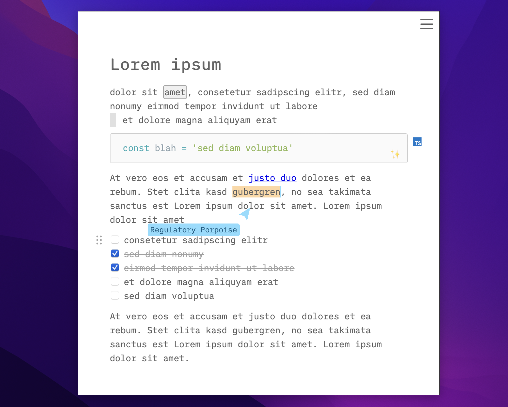
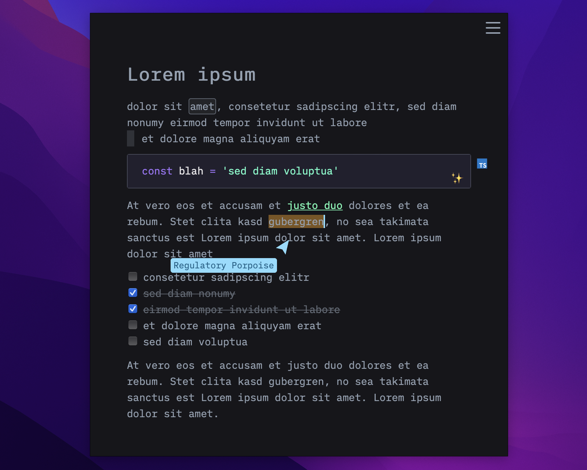

# TinyWrite

Just a little writing tool with markdown shortcuts that saves every change to local indexeddb.

## Install

Download: [releases](https://github.com/dennis84/tiny-write/releases)

Demo: https://tiny-write.pages.dev

## Build

```
npm install

# Build app
npm run dist
# Ubuntu
sudo apt install ./src-tauri/target/release/bundle/deb/tiny-write_x.x.x_amd64.deb

# Develop web
npm run web

# Develop app
npm run app
```
